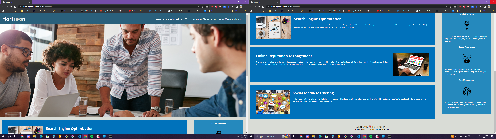

# Horiseon
Challenge for Module 1

The purpose of this project is modifying code received. Make sure that it meets accessibility standarts. It needs to have easily seen semantic HTML elements with a structure that follows a stylized and positioning structure. Utilizing more condensed CSS allows reducing redundant and better read code.

Deployed Application: https://charmingdarling.github.io/Horiseon/

